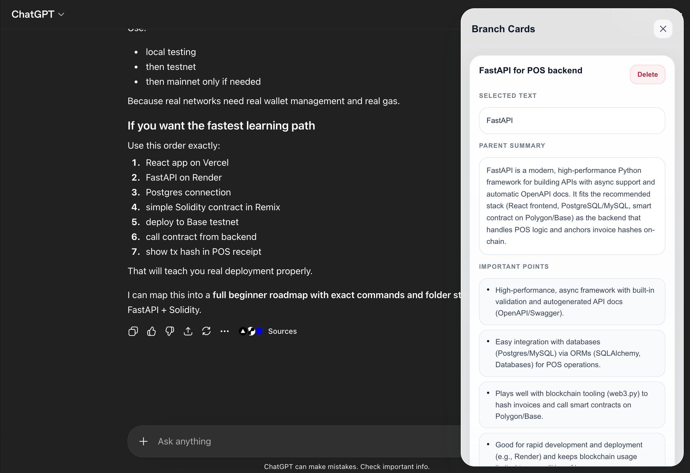
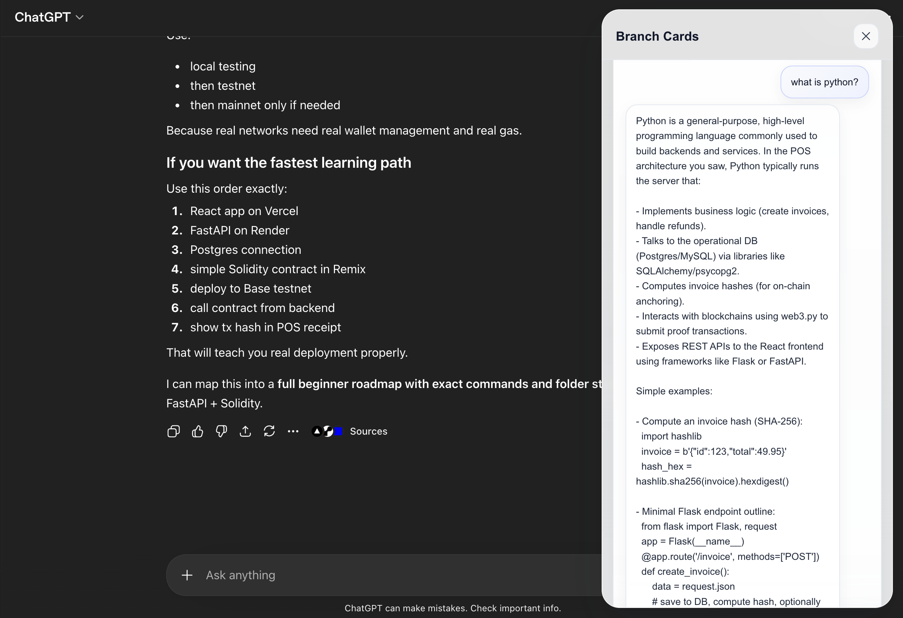

AI Branch Cards — Chrome Extension

A smart Chrome extension that transforms AI conversations into interactive branch cards, allowing users to explore concepts without losing the main chat flow.

⸻

🚀 Overview

When using AI tools like ChatGPT, users often encounter unfamiliar concepts and need to ask follow-up questions — breaking their original context.

AI Branch Cards solves this problem by:
	•	Creating side-branch cards from selected text
	•	Generating context-aware summaries
	•	Allowing follow-up conversations inside each card
	•	Preserving the main chat flow

⸻

✨ Features
	•	Select any text → click Explain
	•	Create branch cards linked to original context
	•	Auto-generate:
	•	Title
	•	Summary
	•	Key points
	•	Ask follow-up questions inside each card
	•	Cards saved per conversation
	•	Clean white glass UI
	•	Lightweight and fast

⸻

🏗️ Tech Stack

Frontend (Chrome Extension)
	•	JavaScript (Vanilla)
	•	Chrome Extensions API (Manifest V3)
	•	DOM Manipulation
	•	CSS (Glass UI)

Backend
	•	Python
	•	Flask
	•	OpenAI API (or Gemini API optional)

⸻

📂 Project Structure

project-root/
│
├── extension/                # Chrome Extension
│   ├── manifest.json
│   ├── content.js
│   ├── styles/
│   │   └── glass.css
│   ├── utils/
│   │   ├── constants.js
│   │   ├── helpers.js
│   │   ├── storage.js
│   │   └── api.js
│   └── features/
│       ├── contextExtractor.js
│       ├── sidebar.js
│       ├── cards.js
│       └── selection.js
│
├── backend/                  # Flask Backend
│   ├── app.py
│   ├── openai-app.py
│   └── .env
│
└── README.md

⸻

⚙️ Setup Instructions

⸻

1. Clone the repository

git clone https://github.com/KushanCS/ticky-otes.git
cd ticky-otes

⸻

2. Setup Backend

Create virtual environment

cd backend
python3 -m venv .venv
source .venv/bin/activate

Install dependencies

pip install flask python-dotenv openai

⸻

3. Add API Key

Create .env file inside backend/:

OPENAI_API_KEY=your_openai_api_key_here
OPENAI_MODEL=gpt-5-mini

⸻

4. Run Backend

python app.py

Server runs at:

http://127.0.0.1:5000

⸻

5. Load Chrome Extension
	1.	Open Chrome
	2.	Go to:

chrome://extensions

	3.	Enable Developer Mode
	4.	Click Load unpacked
	5.	Select the extension/ folder

⸻

6. Run the Extension
	1.	Open ChatGPT
	2.	Select any text
	3.	Click Explain
	4.	Sidebar will appear with a branch card

⸻

Example Workflow
	1.	Ask AI a question
	2.	Select a confusing term
	3.	Click Explain
	4.	A new card appears with:
	•	Summary
	•	Key points
	5.	Ask follow-up questions inside the card

⸻

Troubleshooting

“Failed to fetch”
	•	Make sure backend is running
	•	Check URL: http://127.0.0.1:5000

⸻

“ModuleNotFoundError: openai”

pip install openai

⸻

API quota errors
	•	Use OpenAI instead of Gemini free tier
	•	Or wait for quota reset

⸻

Extension not updating
	•	Reload extension in Chrome
	•	Refresh ChatGPT page

⸻

Why This Project

This project demonstrates:
	•	Chrome Extension development
	•	AI integration (OpenAI / Gemini)
	•	Context-aware UX design
	•	Full-stack architecture

⸻

License

MIT License

⸻

Author

Kushan CS

⸻

If you like this project

Give it a star ⭐ on GitHub — it helps a lot!
